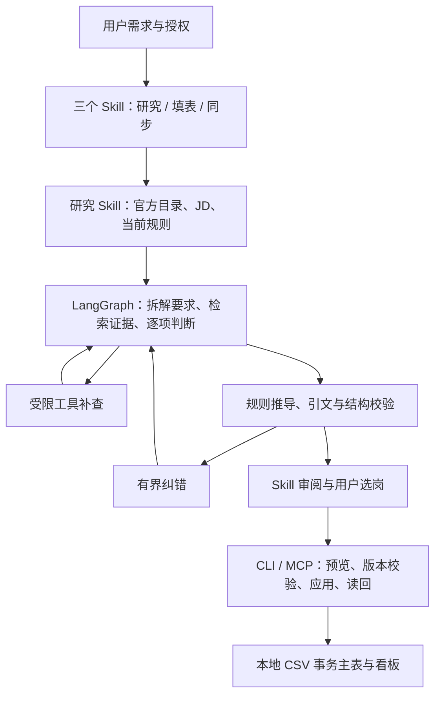

# CareerWorkbench · 求职工作台

[](https://github.com/YoungShip/CareerWorkbench/actions/workflows/test.yml)
[](LICENSE)

面向求职场景的 AI Agent 工程项目：把公司研究、岗位选择、申请准备和进度管理放进同一套可核验的工作流。

本项目源于使用者自行设计的三个 Skill。使用者主导目标、规则、架构与验收，代码由 AI 辅助实现。项目形成过程和各部分归属见 [项目来源](references/project-origin.md)，第三方及历史组件说明见 [THIRD_PARTY_NOTICES.md](THIRD_PARTY_NOTICES.md)。

## 从这里了解项目

| 想了解什么 | 入口 |
|---|---|
| 运行一个无需密钥或个人资料的例子 | 下方快速开始、[离线演示](agent/DEMO.md) |
| Agent 如何调用工具、校验和纠错 | [执行流程与边界](agent/README.md#流程与边界)、[核心流程代码](agent/src/jobmatch/graph.py) |
| 为什么小语料默认全量上下文 | [50 岗 × 4 组评测](agent/EVAL.md)、[检索实现](agent/src/jobmatch/retrieval.py) |
| 当前架构选择做过哪些对比 | [受控架构与检索核验](agent/OPTIMALITY.md) |
| 简历更新后如何防止母表与模型输入脱节 | [资料一致性与更新流程](references/materials-consistency.md) |
| 如何检查语义错误与恢复中断 | [成对语义回归](agent/QUALITY.md)、[检查点恢复](agent/RECOVERY.md) |
| 如何防止未经预览或基于旧版本的写入 | [MCP 预览令牌](references/mcp-server.md)、[事务主表](references/local-tracker.md) |

## 快速开始：独立离线演示

需要 Git、Python 3.12 和 [uv](https://docs.astral.sh/uv/)。首次安装依赖需要网络或本机缓存；**运行演示不需要模型 API、向量模型下载、个人档案或另一个仓库**。

```sh
git clone https://github.com/YoungShip/CareerWorkbench.git
cd CareerWorkbench/agent
uv sync --frozen
uv run --frozen --offline jobmatch demo
```

查看 `demo-output/demo-report.md` 和 `demo-output/demo-summary.json`。两个合成岗位会走完真实 LangGraph 流程：一次证据补查、错误证据 ID 被校验器拒绝后的纠错，以及缺乏实践证据时保留待确认结论。

演示使用**预制模型响应**，验证程序路径；它不展示真实模型准确率，不填写或提交网申，也不修改投递数据。已有输出目录不会被覆盖；重复运行请加 `--out demo-output-2`。中断与恢复示例见 [DEMO.md](agent/DEMO.md)。

## 运行测试

Node 与 Agent 测试会调用正式校验器 `verify-matching.py`，它属于本仓库 [`skills/`](skills/) 中的 campus-recruitment 技能，运行时从仓库同级的 `.agents/skills` 读取。在仓库根目录执行：

```sh
npm ci
npm run test:setup   # 把 skills/ 复制到 ../.agents/skills；已有校验器时不改动
npm test
cd agent && uv sync --frozen && uv run --frozen python -X utf8 -m pytest -q
```

校验器使用的 Python 依次取 `JOBHUNT_PYTHON`、作者本机的 Codex 运行时（存在时）、PATH 上的 `python3`（Windows 为 `python`）。

## 工作流与架构



- **模型负责语义判断，程序负责约束**：Pydantic 输出契约、原文行号回填、真实证据 ID、确定性结论推导、检索与纠错次数上限。
- **检索可以比较**：全量上下文、BM25、BGE + FAISS 向量检索和 RRF 混合检索；当前小型证据库默认全量，保留其他模式用于扩展和实验。
- **写入和恢复可追溯**：MCP 预览令牌绑定计划和版本；主表使用乐观锁、备份与读回；批次按岗位恢复并保留失败尝试。
- **实际提交由授权控制**：匹配 Agent 不自动选岗、提交申请或同步线上记录。模拟演示不接触这些操作。

## 已验证到什么程度

| 检查 | 结果及解释 |
|---|---|
| 同批 50 份历史 JD，4 种配置，共 200 次运行 | 本轮全量配置较混合检索输入 tokens 少约 41.5%，单岗耗时中位数少约 20.9%；这是固定版本、单次端到端比较，不是检索算法的独立因果实验 |
| 5 组、10 例合成反事实案例 | 覆盖学历门槛、或/且、证据强度、必需/加分项、不可信指令；不充当独立人工金标 |
| 构建 wheel 后的隔离演示 | 不存在私有档案或 Skill 安装，运行时阻断网络；中断、恢复、再次恢复依次为 4、2、0 次模拟响应调用 |
| GitHub Actions | Node 与 Python 离线回归，以及构建产物的隔离演示；最新状态见页首 CI 链接 |

具体模型、代码指纹、样本定义与限制保存在 [EVAL.md](agent/EVAL.md)。机械校验通过不等于语义准确，也不等于录用率。真实 JD、个人证据、投递记录、API Key 和浏览器登录态不随仓库公开。

## 接入自己的真实工作区

上面的演示可以独立运行。完整求职工作流还需要配置自己的资料、数据目录和三个 Skill，参见 [Agent 使用指南](agent/USAGE.md)、[三个 Skill](skills/) 与 [MCP 说明](references/mcp-server.md)。Node.js 模块要求 Node.js 20 或更新版本，并通过 `npm ci` 安装锁定依赖。

部分 `AGENTS.md`、`SKILL.md` 和运维文档保留作者的 Windows 工作区路径与授权规则。它们用于说明实际集成环境；新使用者应在自己的隔离目录配置路径和授权，不要把作者的本机设置当成通用安装要求。

### 作者本机的日常使用

在 resume 工作区打开助手会话，直接提出研究公司、比较岗位、准备网申或更新进度的需求。两个 Skill 分别负责公司研究和表单填写；所有提交遵循用户明确授权。

本地看板：http://localhost:8420/dashboard.html 。新界面包含总览、岗位与投递、日程与待办，支持搜索与筛选、查看完整JD和申请历史、编辑备注、管理日程及登记已确认结果。深浅主题和窄屏布局均可用。

Windows 手动打开：dashboard/start-dashboard-silent.bat。登录自启任务为 CareerWorkbench Dashboard。查看状态：node dashboard/serve.js status；停止：node dashboard/serve.js stop。服务只监听 127.0.0.1。

## 模块

| 模块 | 职责 |
|---|---|
| dashboard | CSV 主表、事务存储、CLI、当前看板界面 |
| discovery | 公司线索、研究状态与恢复断点 |
| mcp | 6 个只读工具、事务预览与令牌绑定提交 |
| agent | LangGraph 证据匹配、检索、校验纠错、评测与批次恢复 |
| scripts | 提醒、只读预检、站点经验与工程检查 |
| references | 工作流协议和使用说明 |
| templates | 由现行字段定义生成的空白数据模板 |

## 数据与写入

八份 dashboard CSV 是唯一投递主数据，旧 Excel 已删除，内容保存在 job_pool 的 legacy_record 字段。不要用表格软件直接修改 CSV。

按稳定 job_id 与整体版本执行 snapshot → preview → apply → read-back。本地读回即完成登记。研究结论、用户选岗、实际提交是不同事实。完整规则见 [主表协议](references/local-tracker.md)。

会话只读入口：

    node dashboard/tracker-cli.js brief
    node dashboard/tracker-cli.js rules
    node dashboard/tracker-cli.js query
    node discovery/cli.js next

CLI 落盘使用 --out=<绝对路径>，严格 UTF-8 原子保存。

## Agent 与 MCP

真实研究入口、配置方式和边界见 [Agent 使用指南](agent/USAGE.md)。可先运行 [离线演示](agent/DEMO.md)，观察受限工具补查、纠错、报告和恢复；演示模型响应为模拟数据。

在 agent 目录执行 uv sync --frozen 和 uv run jobmatch doctor。真实模型通过私有配置接入；full 是小型候选证据库的默认方式，也支持 BM25、向量及混合检索。历史评测有明确版本，不等于总体判断准确率。

MCP 使用 npm ci 安装依赖，工作区 .mcp.json 指向 mcp/server.js。MCP 与 CLI 共用同一事务层；预览令牌绑定计划和版本，不代替用户授权。见 [MCP 说明](references/mcp-server.md)。

## 检查与维护

    npm test
    node dashboard/tracker-cli.js validate

在 agent 目录运行 uv run --frozen python -X utf8 -m pytest -q。CI 同时执行 Node、Python 以及隔离 wheel 演示。

主表事务备份在 dashboard/.store/backups。个人资料、凭据、模型、浏览器配置、真实运行和评测数据位于忽略目录，不进入 Git；Git 不能代替这些数据的备份。

当前工作流维护允许修改本项目。个人简历正文和排版按用户指定由简历助手处理。

## 来源与许可

当前看板与启动器在 2026-09-29 重新实现；业务工作流的形成过程与代码来源分别记录，不用旧目录名推断整个项目的开发关系。MIT 许可见 LICENSE；必要历史声明、第三方依赖与校验器来源见 THIRD_PARTY_NOTICES.md。
